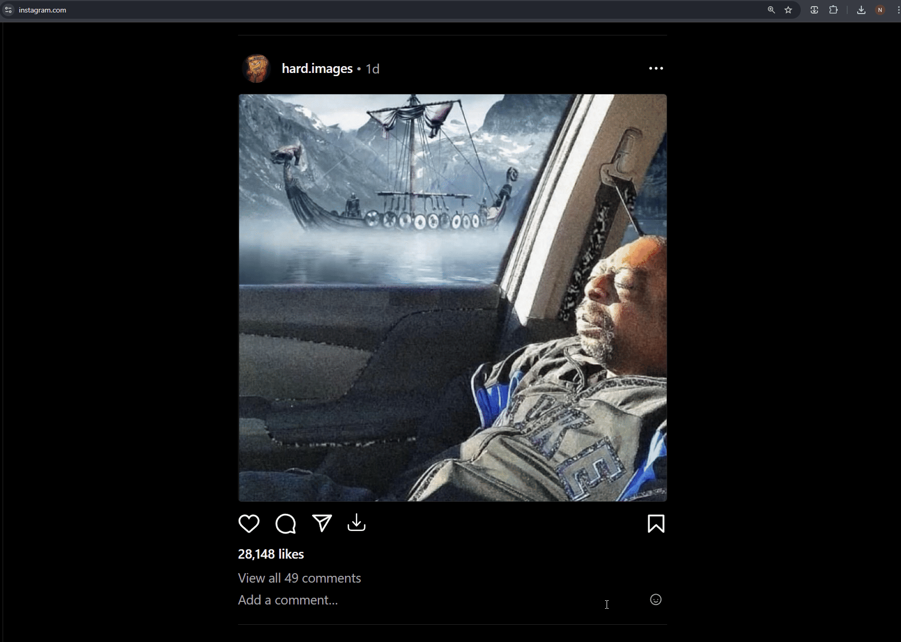

# 📸 Instagram Image Downloader

Instagram Image Downloader is a Chrome extension that allows users to download images from Instagram by adding a download button to each post. The button's appearance adapts to the light or dark mode setting of Instagram.

## ✨ Features

- 📥 Adds a download button to each Instagram post.
- 🌗 Automatically adapts the button's appearance based on Instagram's light or dark mode.
- 🖱️ Downloads images with a single click.

## 🛠️ Installation

1. Clone the repository or download the ZIP file.
2. Open Chrome and navigate to `chrome://extensions/`.
3. Enable "Developer mode" in the top right corner.
4. Click "Load unpacked" and select the directory where you cloned or extracted the repository.

## 🚀 Usage

1. Navigate to Instagram in your Chrome browser.
2. You will see a download button on each post next to "Share" button.
3. Click the download button to save the image to your device.

## 📸 Demo

## 🤝 Contributing

Contributions are welcome! Please open an issue or submit a pull request for any changes.

## 📄 License

This project is licensed under the MIT License. See the [LICENSE](LICENSE) file for details.

## 🙏 Acknowledgements

- [Instagram](https://www.instagram.com) for providing the platform.
- [Chrome Extensions](https://developer.chrome.com/docs/extensions/) documentation for guidance on building extensions.
